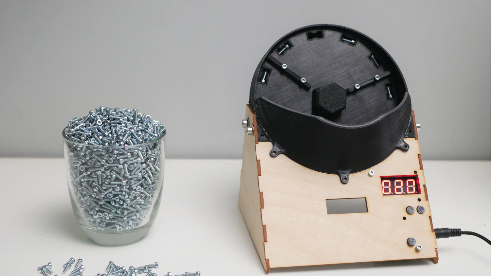

Designed by [Nikodem Bartnik](https://www.youtube.com/nikodembartnik). 

OpenScrewCounter is a machine built to count various small screws. It was built to simplify the counting procedure of set of screws for [IndyMill CNC machine](http://indystry.cc/indymill/). Researching similar solutions resulted in rejecting a few early ideas for the design of this project and in the end a approach presented above was implemented. At this stage the machine is not perfect and some upgrades are required to make it production ready. 

## Open Source
Project is open source and all the files and the code are available above. Feel free to use it, modify and share with others. Contributing to the project is more than welcome! 

## Parts
 - [Raspberry Pi Pico](https://amzn.to/3FnSxVT)
 - [Motor](https://amzn.to/405kJVr)
 - [7 segment display](https://bit.ly/40bwYQB)
 - [Buttons](https://amzn.to/3yK9nul)
 - [6804 Bearing](https://amzn.to/40ppZDR)
 - [Some screws](https://amzn.to/3leCWBm)

## Videos

